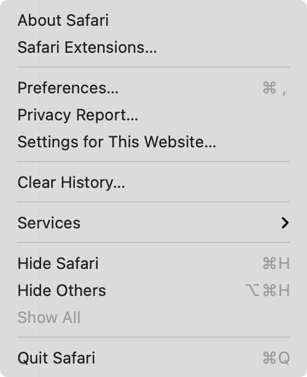
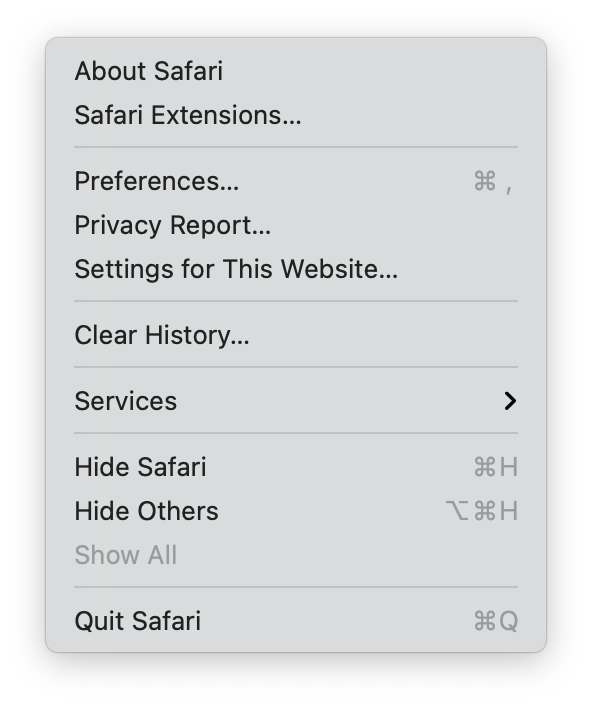

# Kuvatõmmiste \(screenshot\) tegemine

Kuvatõmmist saab teha tervest ekraanist \(_entire screen_\), osast ekraanist \(_portion of the screen_\) või aknast/menüüst \(_window/menu_\) 

## Kuidas teha kuvatõmmist tervest ekraanist

Tervest ekraanist kuvatõmmise \(_screenshot_\) tegemiseks tuleb üheaegselt vajutada kolmele klahvile 

                 ⇧ + ⌘ + 3   \(shift + command + 3\)

Kuvatõmmise pisipilt \(_thumbnail_\) ilmub ekraani nurka. Sellel klõpsates saab seda enne salvestamist redigeerida. Ilma pisipildil klõpsamata salvestatakse kuvatõmmise fail vaikimisi asukohta milleks on töölaud \(_desktop_\).

## Kuidas teha kuvatõmmist ekraani teatud osast

Ekraani teatud osast kuvatõmmise tegemiseks tuleb üheaegselt vajutada kolmele klahvile:

          ⇧ + ⌘ + 4 \(shift + command + 4\)

[Osuti](../terminid/sonastik/osuti-pointer.md) \(_pointer_\) muutub ristmärgiks \(_crosshair_\) 

Lohista \(_drag_\) ristmärki \(_crosshair_\) valimaks ekraani osa millest teha kuvatõmmis. Valitud ekraaniosa liigutamiseks vajuta ja hoia all tühiku klahvi \(_space bar_\) ning lohista. Kuvatõmmise tegemisest loobumiseks vajuta paoklahvile ␛\(_escape_\).

Kuvatõmmise tegemiseks lase hiire nupp lahti või vabasta puuteplaat. 

Kuvatõmmise pisipilt \(_thumbnail_\) ilmub ekraani nurka. Sellel klõpsates saab seda enne salvestamist redigeerida. Ilma pisipildil klõpsamata salvestatakse kuvatõmmise fail vaikimisi asukohta milleks on töölaud \(_desktop_\).

## Kuidas teha kuvatõmmist aknast või menüüst

Ava aken või menüü millest kuvatõmmis teha. 

Vajuta üheaegselt neljale klahvile:

          ⇧ + ⌘ + 4 + ␣ \(shift + command + 4 + space\)

[Osuti](../terminid/sonastik/osuti-pointer.md) \(_pointer_\) muutub kaamera ikooniks 

Kuvatõmmise tegemisest loobumiseks vajuta paoklahvile ␛ \(_escape_\).

Klõpsa aknal \(_window_\) või menüül \(_menu_\) millest tahad kuvatõmmist teha. Akna varju \(_shadow_\) välistamiseks hoia klõpsamise ajal all ⌥ \(_option_\) klahvi.

Kuvatõmmise pisipilt \(_thumbnail_\) ilmub ekraani nurka. Sellel klõpsates saab seda enne salvestamist redigeerida. Ilma pisipildil klõpsamata salvestatakse kuvatõmmise fail vaikimisi asukohta milleks on töölaud \(_desktop_\).

Vasakul pool on ekraanitõmmis mis on tehtud Safari brauseri menüüvalikust `Safari` ilma varjuta ja paremal pool ekraanitõmmis varjuga

   

## Screenshot rakenduse \(app\) valikud \(options\)

Kuvatõmmiste tegemiseks kasutatavat rakenduse Screenshot järgenvaid omadusi saab seadistada:

*  määrata kuvatõmmiste salvestamise asukoha, 
* määrata ajalise viivituse ekraanitõmmise tegemisel \(_timer_\)

| Tegevus | Ikoon |
| :--- | :--- |
| Kuvatõmmis tervest ekraanist |    |
| Kuvatõmmis ekraani teatud osast |   |
| Kuvatõmmis aknast/menüüst |   |
| Salvestus terve ekraan  |   |
| Salvesta osa ekraanist |   |

