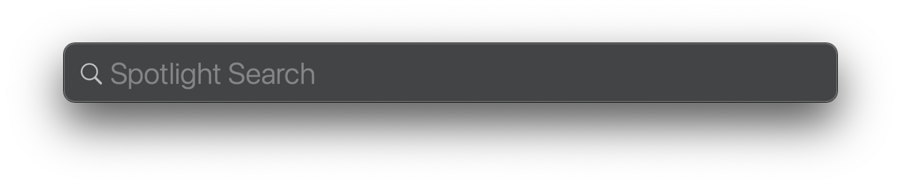

# Kuidas avada rakendusi ja faile

Arvutist ilma rakendustarkvarata on kasutajale vähe kasu. Selleks et arvutiga midagi korda saata \(õppida, töötada või meelt lahutada\) vajab arvuti **rakendusi** \(_applications_\). Veebi sirvimiseks on brauser; e-kirjade lugemiseks, fotode töötlemiseks ja esitluste koostamiseks on oma rakendused.

Selleks, et neid rakendusi kasutama hakata on vaja need kõigepealt **üles leida ja avada**. Paljude rakenduste kasutamise tulemuseks on [fail](../terminid/sonastik/fail-file.md) \(_file_\) milles me [mäluseadmesse](../terminid/sonastik/maeluseade-storage-device.md) \(_storage device_\) [salvestame](../terminid/sonastik/salvestama-to-store.md).

Eespool toodud põhjustel on rakenduste ja failide leidmine ning avamine arvuti kasutamisel oluline ja tähtis rutiin. [Rutiin](https://sonaveeb.ee/search/unif/dlall/dsall/rutiin/1) on  siin tähenduses `üksluine kordus` s.t. midagi, mida on vaja korduvalt teha kuid mis ei ole meie tegevuse eesmärk. Meie eesmärk on **kasutada** rakendusi ja faile ning nende otsimine ja avamine on üks tüütu kuid kohustuslik etapp mille tahaks võimalikul kiiresti läbida ja seljataha jätta. 

Rutiinsete tegevuste korral on oluline leida viis nende kiireks ning automaatseks \(niivõrd, kui inimese puhul automaatsest tegevusest rääkida saab\) täitmiseks.

Kasutajad on erinevad ja sama erinevad on ka nende eelistused. Hea operatsioonisüsteem pakub seetõttu sama tulemuse saavutamiseks erinevaid viise. Rakendusi ja faile saab avada kasutades klaviatuuri või [hiirt](../terminid/sonastik/hiir-mouse.md).  

## Klaviatuur ja Spotlight

Rakenduste ja failide leidmiseks ning avamiseks on macOS-is rakendus **Spotlight** \(_Rambivalgus_\). See on ilma kahtluseta graafilises kasutajaliideses \(GUI\) kõige kiirem viis rakenduste ja failide avamiseks. Selle eelisteks on:

* kasutatav klaviatuurilt s.t. pole vaja kasutada [osutusseadist](../terminid/sonastik/osutusseadis-pointing-device.md) \(_pointing device_\)
* pole vaja  teada rakenduse või faili asukohta ning liikuda [kaustade](../terminid/sonastik/kaust-folder.md) \(_folder_\) hierarhias

Ava Rambivalgus \(_Spotlight_\) kasutades klahvikombinatsioni ⌘ + ␣ \(_command_  + _space_\)

